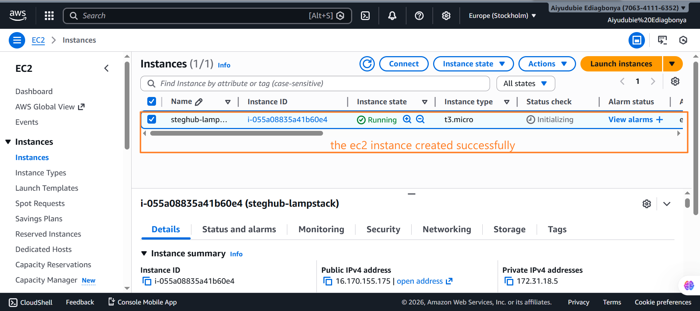
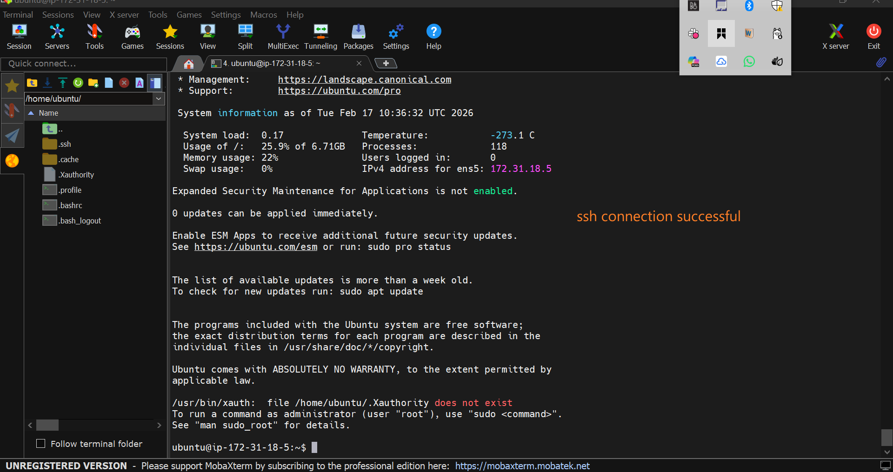
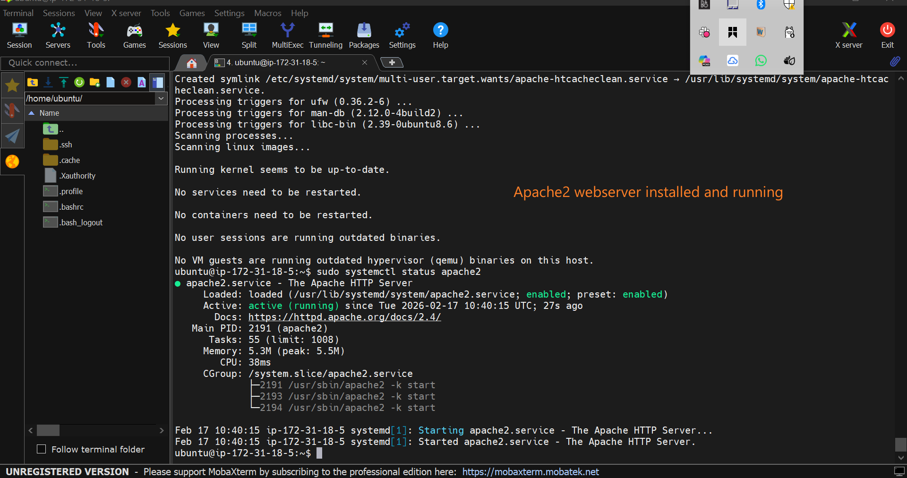
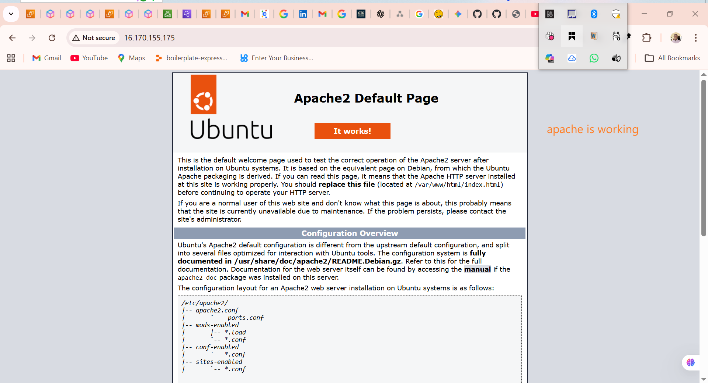
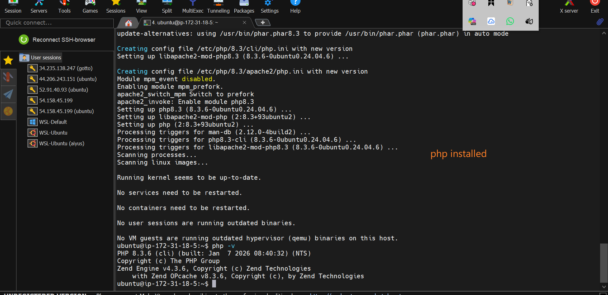

# LAMP Stack Implementation on AWS (How I Did It)

## Project Overview

In this project, I deployed a complete LAMP stack environment on AWS using an Ubuntu EC2 instance. The goal was to understand how infrastructure, web servers, databases, and application layers work together to serve dynamic web content.

LAMP stands for:

* **Linux** – The operating system that runs the server.
* **Apache** – The web server that handles HTTP requests.
* **MySQL** – The database that stores structured data.
* **PHP** – The scripting language that generates dynamic content.

Instead of using automation tools, I intentionally set this up manually to deeply understand each layer of the stack.

---

## Step 1: Provisioning the Server on AWS

I started by launching a virtual server on Amazon Web Services using EC2.



## What is EC2?

EC2 (Elastic Compute Cloud) is a service that allows you to rent virtual servers in the cloud. These servers behave like physical machines, but they are scalable and managed remotely.

## What I Did

* Selected **Ubuntu Server** as the operating system.
* Generated and downloaded a key pair for secure SSH access.
* Configured Security Group rules to allow:

  * Port 22 (SSH) – for remote access.
  * Port 80 (HTTP) – for web traffic.

Security Groups act like a virtual firewall controlling inbound and outbound traffic.

---

## Step 2: Connecting to the Server

After the instance was running, I connected using SSH:



## Concept: SSH

SSH (Secure Shell) allows encrypted remote login into a server. The `.pem` file acts as my private authentication key.

Once connected, I updated the package repository:

```bash
sudo apt update
```

This ensures all software installs from the latest available versions.

---

## Step 3: Installing Apache (Web Server Layer)

I installed the Apache HTTP Server:

```bash
sudo apt install apache2
```

## What is Apache?.

Apache is a web server. When someone types your IP address in a browser, Apache receives that request and responds with website files (HTML, CSS, images, etc.).

I verified that Apache was running:

```bash
sudo systemctl status apache2
```



Then I tested access from the browser using the EC2 public IP address.



At this point, the server could serve static web pages.

---

## Step 4: Installing MySQL (Database Layer)

Next, I installed MySQL:

```bash
sudo apt install mysql-server
```

## What is MySQL?

MySQL is a relational database system. It stores structured data in tables using rows and columns.

I secured the installation using:

```bash
sudo mysql_secure_installation
```


This script:

* Removed anonymous users
* Disabled remote root login
* Removed the test database
* Enforced password security

This step is important because database misconfiguration is a common security vulnerability.

---

## Step 5: Installing PHP (Application Layer)

Then I installed PHP:



```bash
sudo apt install php libapache2-mod-php php-mysql
```

## What is PHP?

PHP is a server-side scripting language. Unlike HTML, which is static, PHP executes on the server and can:

* Fetch data from a database
* Process forms
* Generate dynamic content

After installation, Apache was now capable of processing `.php` files.

I confirmed installation:

```bash
php -v
```

---

## Step 6: Creating a Custom Virtual Host

Instead of using Apache’s default directory (`/var/www/html`), I created a custom project directory:

```bash
sudo mkdir /var/www/projectlamp
sudo chown -R $USER:$USER /var/www/projectlamp
```

## Concept: Virtual Host

A Virtual Host allows Apache to host multiple websites on the same server. Each site can have its own configuration and directory.

I created a configuration file inside:
/etc/apache2/sites-available/projectlamp.conf

Then enabled it:

```bash
sudo a2ensite projectlamp
sudo a2dissite 000-default
sudo apache2ctl configtest
sudo systemctl reload apache2
```


This told Apache to serve my custom directory instead of the default one.

---

## Step 7: Testing Static and Dynamic Content

To confirm everything worked:

1. Created an `index.html` file (static content test).
2. Created an `index.php` file (dynamic content test).

When I accessed the public IP in the browser:

* Apache handled the request.
* PHP processed the script.
* The output was returned to the browser.

This confirmed the full stack was functioning correctly.


---


After testing, I removed unnecessary files for security.

---

## Challenges I Encountered

* Ensuring Security Group rules allowed HTTP traffic.
* Managing correct file permissions.
* Understanding how Apache decides which file to load first.
* Learning how different layers of the stack communicate.

Each issue improved my understanding of server architecture.

---

## Key Concepts Learned

* How cloud infrastructure is provisioned.
* How web servers process client requests.
* How databases store structured data.
* How server-side scripting interacts with databases.
* The importance of securing production environments.

---

## Final Outcome

By the end of this project:

* A fully functional LAMP stack was deployed on AWS.
* Apache was serving content correctly.
* MySQL was installed and hardened.
* PHP was integrated successfully.
* A custom Virtual Host was configured.

This project strengthened my understanding of how traditional web infrastructure works before moving toward automation, containerization, and DevOps practices.
