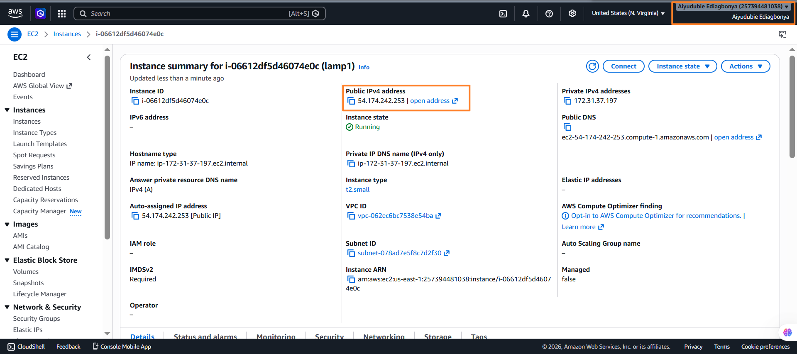
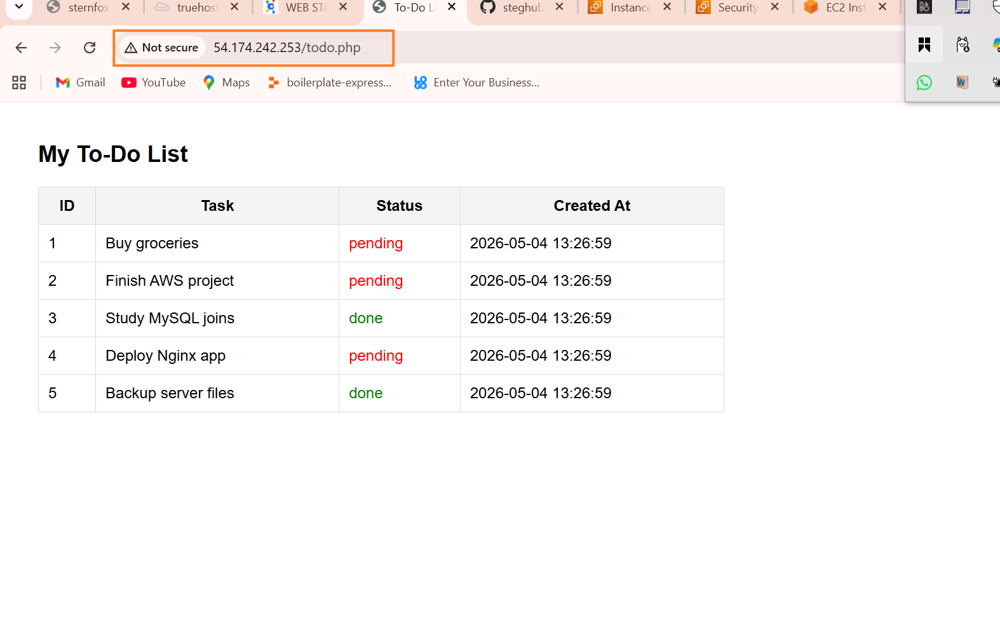

# 🚀 LEMP Stack Deployment on AWS EC2

This project demonstrates the setup and deployment of a **LEMP stack (Linux, Nginx, MySQL, PHP)** on an AWS EC2 instance. It includes configuring the web server, database, and a simple PHP application (To-Do List) connected to MySQL.

---

## 📌 Project Overview

The goal of this project is to:

* Provision a cloud server using AWS EC2
* Install and configure a LEMP stack
* Create and connect a MySQL database
* Build a simple PHP application to interact with the database

---

## 🧱 Tech Stack

* **Linux**: Ubuntu Server (EC2)
* **Web Server**: Nginx
* **Database**: MySQL
* **Backend Language**: PHP (FPM)
* **Cloud Provider**: AWS EC2

---

## ⚙️ Setup & Installation

### 1. Launch EC2 Instance

* Instance type: t2.micro (or higher recommended)
* OS: Ubuntu
* Open ports:

  * `22` (SSH)
  * `80` (HTTP)

---

### 2. Connect to Server

```bash
ssh -i your-key.pem ubuntu@your-public-ip
```

---

### 3. Install Nginx

```bash
sudo apt update
sudo apt install nginx -y
sudo systemctl start nginx
```

---

### 4. Install MySQL

```bash
sudo apt install mysql-server -y
sudo mysql_secure_installation
```

---

### 5. Install PHP (FPM) & Extensions

```bash
sudo apt install php php-fpm php-mysql -y
```

---

### 6. Configure Nginx for PHP

Create a server block:

```bash
sudo nano /etc/nginx/sites-available/projectlamp
```

Example config:

```nginx
server {
    listen 80;
    server_name _;

    root /var/www/projectlamp;
    index index.php index.html;

    location / {
        try_files $uri $uri/ =404;
    }

    location ~ \.php$ {
        include snippets/fastcgi-php.conf;
        fastcgi_pass unix:/run/php/php-fpm.sock;
    }
}
```

Enable configuration:

```bash
sudo ln -s /etc/nginx/sites-available/projectlamp /etc/nginx/sites-enabled/
sudo nginx -t
sudo systemctl restart nginx
```

---

## 🗄️ Database Setup

### Create Database & Table

```sql
CREATE DATABASE todo_app;
USE todo_app;

CREATE TABLE todos (
    id INT AUTO_INCREMENT PRIMARY KEY,
    task VARCHAR(255),
    status ENUM('pending', 'done'),
    created_at TIMESTAMP DEFAULT CURRENT_TIMESTAMP
);
```

### Insert Sample Data

```sql
INSERT INTO todos (task, status) VALUES
('Buy groceries', 'pending'),
('Finish project', 'pending'),
('Study MySQL', 'done');
```

---

## 💻 PHP Application

Create `index.php` in `/var/www/projectlamp/`:

* Connects to MySQL
* Fetches records from `todos` table
* Displays them in a simple HTML table

---

## 🌐 Access Application

Open in browser:

```
http://your-public-ip
```

---

## 🧪 Testing

* Ensure Nginx is running:

  ```bash
  sudo systemctl status nginx
  ```

* Ensure PHP-FPM is running:

  ```bash
  sudo systemctl status php-fpm
  ```

* Test database connection via PHP page

---

## ⚠️ Common Issues & Fixes

| Issue                   | Solution                            |
| ----------------------- | ----------------------------------- |
| 403 Forbidden           | Check file permissions & index file |
| 502 Bad Gateway         | Ensure PHP-FPM is running           |
| MySQL connection failed | Verify credentials                  |
| Nginx config error      | Run `nginx -t`                      |

---

## 🔐 Security Notes

* Avoid using MySQL `root` user in production
* Restrict inbound traffic in AWS Security Groups
* Consider enabling HTTPS using Let's Encrypt

---

## 🚀 Future Improvements

* Add CRUD functionality (Create, Update, Delete tasks)
* Implement user authentication
* Deploy domain and SSL
* Use environment variables for credentials

---

## 📷 Screenshots





## 📄 License

This project is for educational purposes.

---

## 🙌 Acknowledgment

Built as part of hands-on cloud and DevOps learning.
