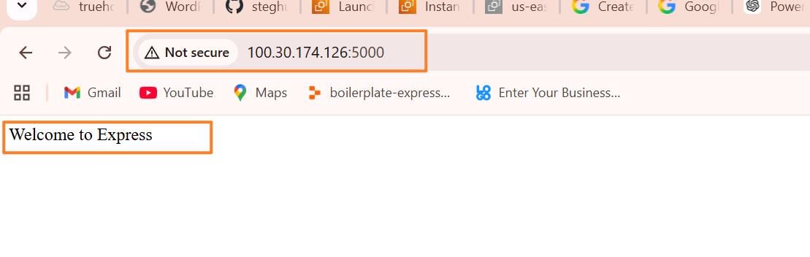

Here’s your updated **practical first-person README.md** with a **“Challenges I faced”** section added:

---

```md id="c8m2qk"
# 📝 MERN Todo App

This is a simple **Todo application I built using the MERN stack (MongoDB, Express, React, Node.js)**.  
It allows me to create, view, and delete tasks using a full-stack setup with a REST API and a React frontend.

---

## 🚀 What this project does

In this project, I:

- Add new todo tasks
- View all saved todos from MongoDB
- Delete todos when they are completed
- Connect a React frontend to an Express backend
- Store and retrieve data from MongoDB

---

## 🛠️ Tech Stack I used

**Frontend:**
- React (Vite)
- Axios
- CSS

**Backend:**
- Node.js
- Express.js

**Database:**
- MongoDB
- Mongoose

---

## 📁 Project Structure

```

todo/
│
├── client/              # React frontend
│   ├── src/
│   │   ├── components/
│   │   │   ├── Todo.js
│   │   │   ├── Input.js
│   │   │   └── ListTodo.js
│   │   ├── App.js
│   │   └── App.css
│
├── models/
│   └── todo.js
│
├── routes/
│   └── api.js
│
├── index.js
├── package.json
└── .env

````

---

## ⚙️ How I run the project

### 1. Install backend dependencies
```bash
npm install
````

### 2. Install frontend dependencies

```bash
cd client
npm install
cd ..
```

### 3. Start the project (both frontend and backend)

```bash
npm run dev
```

---

## 🌐 API Endpoints I used

| Method | Endpoint       | What it does   |
| ------ | -------------- | -------------- |
| GET    | /api/todos     | Get all todos  |
| POST   | /api/todos     | Add a new todo |
| DELETE | /api/todos/:id | Delete a todo  |

---

## 🧠 Challenges I faced

While building this project, I encountered several challenges:

* I had issues setting up the **correct folder structure for React components**, which caused import errors.
* I faced **Vite configuration problems**, especially with incorrect syntax in `vite.config.js`, which prevented the frontend from starting.
* I struggled with **port conflicts**, where the frontend kept switching between ports like 3000 and 5173.
* My API requests in Postman were **hanging**, which was caused by missing responses in my Express routes.
* I also experienced **blank screen issues in React**, which were caused by small JavaScript errors and missing exports/imports.
* Connecting the frontend to the backend using Axios required proper setup of routes and middleware like `express.json()`.

These challenges helped me understand how full-stack debugging works and improved my confidence in handling real-world MERN issues.

---

## 🧠 What I learned

Through this project, I learned how to:

* Build REST APIs using Express
* Connect Node.js to MongoDB using Mongoose
* Create reusable React components
* Manage state in React
* Send and receive data using Axios
* Debug full-stack applications step by step
* Structure a full MERN application properly

---

## Screen Shots




